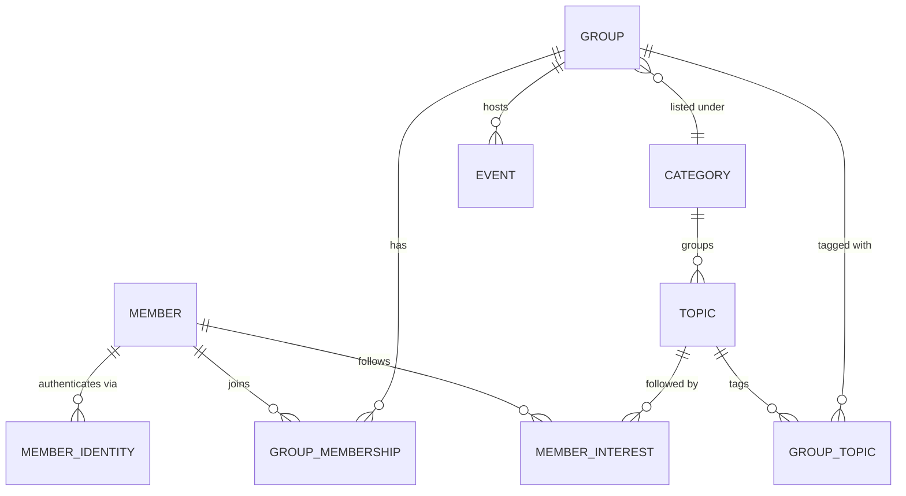
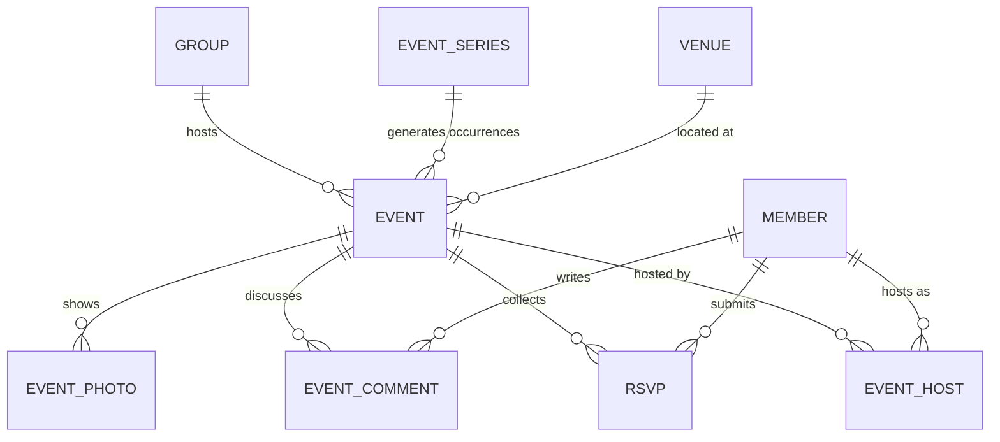
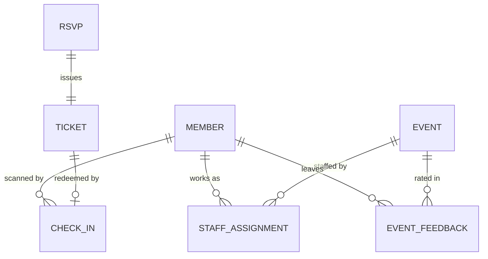

# Domain model

Entity and DTO design for ShowUp, modelled on Meetup's product surface and extended with the
attendance features in the [README](../README.md): staffing, QR check-in, and organizer reporting.

## Scope

Grounded in what Meetup's public search surface actually exposes: 24 interest categories, filters
for distance / date / event size / online-vs-in-person, and per-event price, attendance count,
group rating, and a **Full / Waitlist / Seats available** state.

**In scope.** Members and SSO identities, groups, topics, memberships with organizer roles, venues
with geo search, events (one-off and recurring, in-person/online/hybrid), RSVPs with waitlisting,
tickets, QR check-in, staff assignments, comments, photos, and post-event feedback.

**Deliberately out of scope for now**, each because it is a subsystem rather than a table:

| Deferred | Why |
| --- | --- |
| Payment capture, payouts, refunds | Needs a PSP integration and a ledger. `Event` still carries a fee so pricing and reporting work; only the money movement is absent. |
| Group dues / subscriptions | Recurring billing, dunning, proration. Independent of the event model. |
| Direct messaging | Its own inbox/threading domain with separate read-model needs. |
| Feed ranking and recommendations | Derived from this data; needs a search/ranking store, not an OLTP table. |
| Abuse reports and moderation queues | Workflow domain layered on top once there is content to moderate. |

## Bounded areas

Suggested package layout, one package per area, mirroring how the tables cluster:

```
com.showup.api
├── shared/       BaseEntity, Address, Money, GeoPoint
├── member/       Member, MemberIdentity, MemberInterest
├── topic/        Category, Topic
├── group/        Group, GroupMembership, GroupTopic
├── venue/        Venue
├── event/        Event, EventSeries, EventHost, EventComment, EventPhoto
├── rsvp/         Rsvp
└── attendance/   Ticket, CheckIn, StaffAssignment, EventFeedback
```

### Social graph



### Event lifecycle



### Attendance and staffing



## Entities

Every table carries the same audit columns, so they are omitted from the field lists below.
Put them on a `@MappedSuperclass`:

| Column | Type | Notes |
| --- | --- | --- |
| `id` | `uuid` | PK, default `uuidv7()` |
| `created_at` | `timestamptz` | `default now()`, never updated |
| `updated_at` | `timestamptz` | maintained by `@PreUpdate` |
| `version` | `bigint` | `@Version`, optimistic locking |

### Member

The person. Authentication lives here; the profile is small enough not to warrant a separate table.

| Field | Type | Notes |
| --- | --- | --- |
| `email` | `citext` | unique, the login handle |
| `passwordHash` | `varchar(100)` | nullable — SSO-only members have none |
| `displayName` | `varchar(80)` | shown on RSVPs and comments |
| `bio` | `text` | |
| `photoUrl` | `varchar(500)` | |
| `homeCity` / `homeCountry` | `varchar` | seeds the default location filter |
| `homeLocation` | `geography(Point)` | for "events near me" |
| `status` | enum | `ACTIVE`, `SUSPENDED`, `DEACTIVATED` |
| `emailVerifiedAt` | `timestamptz` | null until verified |

`passwordHash` must never appear in any DTO. That is the single strongest argument for the
"no entities on the wire" rule below.

### MemberIdentity

One row per linked SSO provider — Meetup's login page offers Google, Apple, and Facebook, and a
member can link several. Separating this from `Member` means adding a provider is a row, not a
migration.

| Field | Type | Notes |
| --- | --- | --- |
| `member` | FK → Member | cascade delete |
| `provider` | enum | `GOOGLE`, `APPLE`, `FACEBOOK` |
| `subject` | `varchar(255)` | provider's stable user id |

Unique on `(provider, subject)`, and on `(member_id, provider)`.

### Category and Topic

Two levels, because Meetup has exactly 24 broad categories used for browsing, and a long tail of
fine-grained topics used for tagging and matching. Collapsing them into one table forces a choice
between a browsable short list and useful tags.

**Category** — `slug` (unique), `name`, `iconUrl`, `displayOrder`.
**Topic** — `category` FK, `slug` (unique), `name`, `groupCount` (denormalized, for sorting).

`MemberInterest` and `GroupTopic` are the join tables, each unique on their pair.

### Group

| Field | Type | Notes |
| --- | --- | --- |
| `urlname` | `varchar(80)` | unique, the public slug |
| `name` | `varchar(120)` | |
| `description` | `text` | |
| `category` | FK → Category | primary listing category |
| `city` / `country` | `varchar` | |
| `location` | `geography(Point)` | distance filter |
| `timeZone` | `varchar(64)` | IANA, default for new events |
| `visibility` | enum | `PUBLIC`, `PRIVATE` |
| `joinPolicy` | enum | `OPEN`, `APPROVAL_REQUIRED`, `INVITE_ONLY` |
| `memberCount` | `int` | denormalized |
| `ratingAverage` | `numeric(2,1)` | denormalized from feedback |
| `ratingCount` | `int` | |
| `foundedAt` | `timestamptz` | |
| `status` | enum | `ACTIVE`, `ARCHIVED` |

`memberCount` and `ratingAverage` are denormalized on purpose. Search results show both on every
card; computing them per row turns one list query into two aggregate scans per result.

### GroupMembership

| Field | Type | Notes |
| --- | --- | --- |
| `group` / `member` | FK | unique together |
| `role` | enum | `ORGANIZER`, `CO_ORGANIZER`, `ASSISTANT_ORGANIZER`, `EVENT_ORGANIZER`, `MEMBER` |
| `status` | enum | `ACTIVE`, `PENDING_APPROVAL`, `BANNED`, `LEFT` |
| `joinedAt` | `timestamptz` | |
| `introduction` | `text` | answer to the group's join question |

This is the authorization table: who may edit an event, scan tickets, or see the attendee list is
a function of `role` here. Exactly one `ORGANIZER` per group — enforce in the service layer, since
a partial unique index on `(group_id) where role = 'ORGANIZER'` also blocks organizer handover in
a single transaction.

### Venue

Reusable across events, so a group's regular space is entered once.

`name`, `addressLine1`, `addressLine2`, `city`, `region`, `postalCode`, `country`,
`location geography(Point)`, `notes` (parking, buzzer codes), `createdByGroup` FK.

Index: GiST on `location` for radius search.

### Event

The heart of the model.

| Field | Type | Notes |
| --- | --- | --- |
| `group` | FK → Group | |
| `series` | FK → EventSeries | null for one-offs |
| `title` | `varchar(200)` | |
| `description` | `text` | |
| `status` | enum | `DRAFT`, `PUBLISHED`, `CANCELLED` |
| `format` | enum | `IN_PERSON`, `ONLINE`, `HYBRID` |
| `venue` | FK → Venue | required unless `ONLINE` |
| `onlineUrl` | `varchar(500)` | required unless `IN_PERSON` |
| `startsAt` / `endsAt` | `timestamptz` | stored UTC |
| `timeZone` | `varchar(64)` | IANA name, e.g. `Europe/Bucharest` |
| `capacity` | `int` | null = unlimited |
| `waitlistEnabled` | `boolean` | |
| `guestsPerRsvpLimit` | `int` | 0 = no guests |
| `feeAmountMinor` | `bigint` | e.g. 2700 = £27.00 |
| `feeCurrency` | `char(3)` | ISO 4217 |
| `rsvpOpensAt` / `rsvpClosesAt` | `timestamptz` | |
| `visibility` | enum | `PUBLIC`, `MEMBERS_ONLY` |
| `yesRsvpCount` / `waitlistCount` | `int` | denormalized |

Three decisions worth defending:

**Store the instant *and* the IANA zone.** A `timestamptz` alone answers "when", not "when locally".
An event created for 19:00 in March that a DST shift moves is a bug you cannot fix without the
original zone, and organizer reports need local-time grouping.

**Money as integer minor units plus a currency code.** Never `double` — `0.1 + 0.2` is a support
ticket. Two columns rather than a Postgres composite type keeps JPA mapping trivial via `@Embeddable Money`.

**`capacity` nullable rather than sentinel `-1` or `MAX_INT`.** Null means unlimited and the check
constraint stays `capacity > 0`, so a nonsense zero-capacity event cannot be persisted.

### EventSeries

Recurrence, kept separate so occurrences are real rows that can each be individually cancelled,
re-venued, or over-attended.

`group` FK, `recurrenceRule` (RFC 5545 RRULE string), `until`, `templateTitle`,
`templateDescription`, `templateVenue` FK, `templateDurationMinutes`.

Materialize occurrences ahead of time rather than computing them on read: an RRULE cannot be
indexed, joined against RSVPs, or reported on.

### EventHost

`event` FK, `member` FK, `role` (`HOST`, `CO_HOST`), unique on the pair. Distinct from
`StaffAssignment` — hosts are public-facing and shown on the event page; staff are operational.

### Rsvp

| Field | Type | Notes |
| --- | --- | --- |
| `event` / `member` | FK | **unique together** |
| `status` | enum | `YES`, `NO`, `WAITLISTED` |
| `guestCount` | `int` | `<= event.guestsPerRsvpLimit` |
| `waitlistPosition` | `int` | null unless `WAITLISTED` |
| `respondedAt` | `timestamptz` | |
| `promotedAt` | `timestamptz` | set when lifted off the waitlist |

The unique constraint on `(event_id, member_id)` is the one that matters: it is the database-level
guarantee that a member cannot double-book by double-clicking. Seat allocation itself is a
transaction that takes a row lock on `event`, re-reads `yesRsvpCount`, and either seats or
waitlists — the counter is denormalized, so it must be written under the same lock that reads it.

### Ticket

One per seated RSVP, carrying the QR payload. Separate from `Rsvp` because a ticket has its own
lifecycle: it can be reissued if a member loses it, without disturbing the RSVP.

`rsvp` FK (unique), `code` (`varchar(64)`, unique, the QR payload), `issuedAt`, `revokedAt`,
`admitCount` (1 + guests).

Make `code` a random 128-bit value, not the RSVP id — a guessable code is a free entry, and ticket
ids should not be enumerable.

### CheckIn

`ticket` FK (unique — one check-in per ticket), `checkedInAt`, `checkedInBy` FK → Member,
`method` (`QR_SCAN`, `MANUAL`), `admittedCount`.

The unique FK is what makes double-scanning idempotent instead of double-counting.

### StaffAssignment

`event` FK, `member` FK, `role` (`GREETER`, `SCANNER`, `SETUP`, `AV`, `SPEAKER_LIAISON`, `CLEANUP`),
`shiftStartsAt`, `shiftEndsAt`, `notes`. Unique on `(event, member, role)`.

`SCANNER` is the role the check-in endpoint authorizes against, alongside group organizers.

### EventComment, EventPhoto, EventFeedback

**EventComment** — `event` FK, `author` FK, `body`, `parentComment` FK (one level of replies),
`deletedAt` (soft delete, so reply threads survive a removed parent).

**EventPhoto** — `event` FK, `uploadedBy` FK, `url`, `caption`, `width`, `height`. Store the URL;
bytes belong in object storage, never in Postgres.

**EventFeedback** — `event` FK, `member` FK (unique together), `rating` 1–5, `comment`,
`submittedAt`. Rolls up into `Group.ratingAverage`.

## Enums

Persist as `varchar` with `@Enumerated(EnumType.STRING)` plus a `check` constraint — not as
Postgres `enum` types, and never as ordinals. Ordinals renumber silently when someone inserts a
constant; native enum types need a migration to add a value and cannot drop one.

## Indexes

Beyond the PKs and the unique constraints already named:

| Table | Index | Serves |
| --- | --- | --- |
| `event` | `(group_id, starts_at desc)` | a group's upcoming events |
| `event` | `(status, starts_at) where status = 'PUBLISHED'` | the public browse list |
| `venue` | GiST `(location)` | radius filter |
| `group` | GiST `(location)` | radius filter |
| `rsvp` | `(member_id, created_at desc)` | "my events" |
| `rsvp` | `(event_id, status)` | attendee list, counts |
| `ticket` | `(code)` unique | scan lookup — the hot path at the door |
| `group_membership` | `(member_id, status)` | "my groups" |

## DTOs

**Entities never cross the controller boundary.** Four concrete reasons, not style:

1. `Member.passwordHash` and `MemberIdentity.subject` would serialize by default. One forgotten
   `@JsonIgnore` is a credential leak.
2. Lazy associations serialize as proxies or trigger N+1 queries mid-response, after the
   transaction has closed.
3. The wire format becomes coupled to the schema — renaming a column becomes a breaking API change.
4. Request bodies binding straight to entities are mass-assignment holes: a crafted payload sets
   `status` or `role`.

Java `record`s for all of them: immutable, no boilerplate, and Jackson handles them natively.

### Shape per endpoint

Two response shapes per resource, because list and detail have opposite cost profiles. A search
page renders 20 cards and must not trigger 20 association loads; a detail page wants everything.

| Resource | Summary (lists) | Detail |
| --- | --- | --- |
| Group | `GroupSummary` | `GroupDetail` |
| Event | `EventSummary` | `EventDetail` |
| Member | `MemberSummary` | `MemberProfile` |

```java
// List card — mirrors exactly what Meetup's search results render.
public record EventSummary(
        UUID id, String title, Instant startsAt, String timeZone,
        EventFormat format, String venueCity,
        Money fee, int yesRsvpCount, Integer capacity,
        AvailabilityState availability,   // SEATS_AVAILABLE | WAITLIST | FULL
        GroupSummary group) {}

public record EventDetail(
        UUID id, String title, String description, EventStatus status,
        EventFormat format, VenueSummary venue, String onlineUrl,
        Instant startsAt, Instant endsAt, String timeZone,
        Integer capacity, boolean waitlistEnabled, int guestsPerRsvpLimit,
        Money fee, Instant rsvpOpensAt, Instant rsvpClosesAt,
        int yesRsvpCount, int waitlistCount, AvailabilityState availability,
        GroupSummary group, List<MemberSummary> hosts,
        RsvpSummary viewerRsvp) {}   // null when not signed in
```

`availability` is computed server-side rather than shipping raw counts for the client to compare.
Two clients would otherwise implement that rule differently, and it is exactly the
Full/Waitlist/Seats-available badge the product shows.

`viewerRsvp` folds the viewer's own state into the detail payload, saving every client a second
round trip purely to decide the button label.

### Requests

Validated with `jakarta.validation`, and containing only fields a caller may legitimately set —
note the absence of `status`, `yesRsvpCount`, and `group`:

```java
public record CreateEventRequest(
        @NotBlank @Size(max = 200) String title,
        @Size(max = 20_000) String description,
        @NotNull EventFormat format,
        UUID venueId,
        @Size(max = 500) String onlineUrl,
        @NotNull @Future Instant startsAt,
        Instant endsAt,
        @NotBlank String timeZone,
        @Positive Integer capacity,
        boolean waitlistEnabled,
        @PositiveOrZero int guestsPerRsvpLimit,
        @PositiveOrZero long feeAmountMinor,
        @Pattern(regexp = "[A-Z]{3}") String feeCurrency,
        Instant rsvpOpensAt, Instant rsvpClosesAt) {}
```

Cross-field rules — venue required unless `ONLINE`, `onlineUrl` required unless `IN_PERSON`,
`endsAt` after `startsAt`, `timeZone` a real IANA id — belong in a custom class-level constraint,
since no single-field annotation can express them.

State transitions get their own endpoints and DTOs rather than a patchable `status` field:
`POST /events/{id}/publish`, `/cancel`. An enum in a request body invites illegal transitions
(`CANCELLED` → `DRAFT`) that then need guarding anyway.

### Full DTO catalog

| Group | DTOs |
| --- | --- |
| Auth | `RegisterRequest`, `LoginRequest`, `TokenResponse`, `SsoLoginRequest` |
| Member | `MemberSummary`, `MemberProfile`, `UpdateProfileRequest`, `UpdateInterestsRequest` |
| Topic | `CategorySummary`, `TopicSummary` |
| Group | `GroupSummary`, `GroupDetail`, `CreateGroupRequest`, `UpdateGroupRequest`, `JoinGroupRequest`, `GroupMemberSummary`, `UpdateMemberRoleRequest` |
| Venue | `VenueSummary`, `CreateVenueRequest` |
| Event | `EventSummary`, `EventDetail`, `CreateEventRequest`, `UpdateEventRequest`, `CancelEventRequest`, `EventSearchQuery` |
| Series | `EventSeriesDetail`, `CreateEventSeriesRequest` |
| RSVP | `RsvpSummary`, `SubmitRsvpRequest`, `AttendeeSummary` |
| Attendance | `TicketResponse`, `CheckInRequest`, `CheckInResponse`, `StaffAssignmentSummary`, `AssignStaffRequest` |
| Feedback | `EventFeedbackSummary`, `SubmitFeedbackRequest` |
| Reporting | `EventAttendanceReport`, `GroupActivityReport` |
| Shared | `Money`, `PageResponse<T>`, `ApiError` |

`EventSearchQuery` binds the facets the product actually filters on: `lat`, `lon`,
`radiusKm`, `categorySlug`, `topicSlugs`, `format`, `dateFrom`, `dateTo`, `maxFee`,
`availability`, plus `page`/`size`/`sort`.

`PageResponse<T>` wraps list results rather than returning Spring's `Page` — `Page` serializes an
unstable internal shape that Spring Boot warns about, and pins your API to Spring's class layout.

Reporting DTOs are read models assembled by projection queries, with no entity of their own:
`EventAttendanceReport` carries registered / attended / no-show counts, attendance rate, check-in
times, and per-staff scan totals.

## Migration plan

The current `V1__create_event.sql` models a standalone event with a `location` string and no group.
It is superseded by this design.

Since nothing is deployed and the only database is local, **replace `V1` rather than stacking a
corrective `V2`** — a fresh clone should not have to replay a schema that never existed anywhere.
This is a one-time liberty available only pre-production; once any environment has applied a
migration, it is immutable and every change is a new version.

| Version | Contents |
| --- | --- |
| `V1__create_identity.sql` | `member`, `member_identity`, `category`, `topic`, `member_interest` |
| `V2__create_group.sql` | `group`, `group_membership`, `group_topic`, `venue` |
| `V3__create_event.sql` | `event_series`, `event`, `event_host`, `rsvp` |
| `V4__create_attendance.sql` | `ticket`, `check_in`, `staff_assignment`, `event_feedback` |
| `V5__create_content.sql` | `event_comment`, `event_photo` |
| `R__seed_categories.sql` | Repeatable: the 24 categories and their topics |

Split by area rather than one big file so a failure is traceable to a bounded change. Categories
go in a repeatable migration because the list evolves and is reference data, not user data.

`Group` needs quoting as `"group"` in DDL — it is a reserved SQL word. Consider `meetup_group` to
avoid a permanent quoting tax in every hand-written query.

## Extensions, and one open decision

`citext` ships with the official image, so case-insensitive email is free:

```sql
create extension if not exists citext;
```

Postgres 18 provides `uuidv7()` natively — verified on our `postgres:18-trixie` container, no
extension needed. Prefer it over `uuidv4()` for primary keys: v7 embeds a timestamp prefix, so
inserts land at the right edge of the B-tree instead of scattering random writes across the index.

**Geo is an open decision.** PostGIS is *not* available in the official Postgres image — only
`cube` and `earthdistance` are. Since distance is a primary browse facet ("within 18 miles"), this
has to be settled before the venue and group tables are written:

| Option | Cost | Ceiling |
| --- | --- | --- |
| **PostGIS** (recommended) — switch image to `postgis/postgis:18-3.6` | Third-party image, and the Testcontainers image string changes too | `geography(Point)` with spheroid-accurate distance, `ST_DWithin` on GiST, and KNN `<->` ordering for "nearest N" |
| `earthdistance` + `cube` — stay on the official image | None; both are contrib modules already present | Sphere approximation only, `ll_to_earth()` GiST for radius search, awkward for distance-sorted results |

I'd take PostGIS. Both are accurate enough for a radius filter — I measured Cluj→Bucharest at
324.6 km with `earthdistance`, which is right — but "events near me, nearest first" is the query
this product lives on, and KNN ordering is where the contrib module runs out of road. The switch is
a one-line image change now and a painful backfill later.

If we stay on the official image instead, the schema changes to `latitude`/`longitude` as
`double precision` with a GiST index on `ll_to_earth(latitude, longitude)`.
